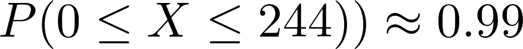
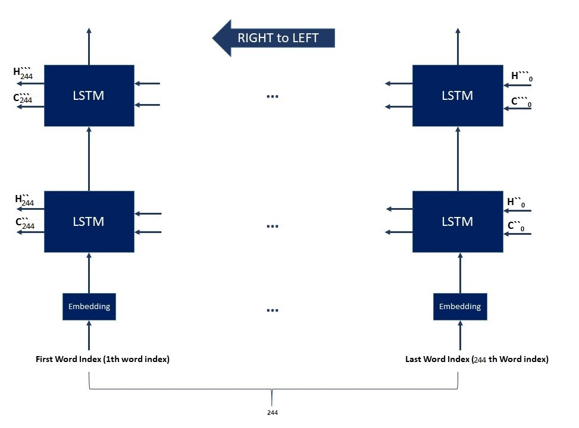

# Comment analyzer
This is a sentiment analysis project. A Deep learning model which can detect the comment given for a product is positive or negative !

<ins>[Preview](#preview)</ins>&nbsp;&nbsp;&nbsp;
<ins>[Details](#Details)</ins>&nbsp;&nbsp;&nbsp;
<ins>[Network](#Network)</ins>&nbsp;&nbsp;&nbsp;
<ins>[Hyperparameters](#Hyperparameters)</ins>&nbsp;&nbsp;&nbsp;
<ins>[Results](#Results)</ins>&nbsp;&nbsp;&nbsp;
<ins>[References](#References)</ins>&nbsp;&nbsp;&nbsp;
<ins>[Useful Resources](#Useful-Resources)</ins>

# Preview

# Details of Implementation
## Dataset 

- [Amazon Reviews for Sentiment Analysis](https://www.kaggle.com/bittlingmayer/amazonreviews/)

This dataset consists of a **~4 million** Amazon customer reviews(**~3.6million** for training and **0.4million** for testing).

It has 2 labels: 

- <b>Label 1 </b> : for comments corresponds to 1 and 2 star reviews (<b>Negative</b>).

- <b>Label 2 </b> : for comments corresponds to 3 and 4 star reviews (<b>Positive</b>).

## Prerprocessing

I just used 1 million samples for training(validating) and 400000 samples for testing.

- **Train set** : 800000 samples.
- **Validation set** : 200000 samples.
- **Test set** : 400000 samples.
  
- [x] Each sample  is sequnece of sentences.

- [x] First, each sample became a sequence of vocabs(tokens).

- [x] The length of each sample is considered the size of this sequence.

- [x] The length of samples are different. For Mini batch gradient descent we need to have samples with the same lenghts.

##### So what is the solution?
###### We can only consider the first N Vocabs(Tokens) for each sample.

###### Then, we can add enough \<pad\> token to samples with a length of less than N to reach a length of N.
 
##### But, what is the value of N?
###### Lets assume the lenght of samples in the train set is a random variable X with a Normal distribution.
###### The average length of the samples in the training set is 92.78 and the standard deviation is 50.22.

###### We know in the noraml distribution we have : 

###### So, here we have : 

##### Thus, considering *N = 194* can be a good choice !

# Network
#### The network consists of 3 parts:
###### 1. Encoder (2-layer and Bidirectional - LSTM)
###### 2. Encoder2Decoder (MLP)
###### 3. Decoder (wih Attention - LSTM)

## 1. Encoder
####  Word indexes 1 to 194 are given to a 2 layer bidirectional LSTM (Encoder).

||
|:--:| 
|Left to Right Direction|

||
|:--:| 
|Right to Left Direction|

#### 2. Encoder2Decoder

The hiddens af last layer was given to the Encoder2Decoder Network(MLP) to obtain the decoder hiddens.

This network receives hiddens of the last time step in the encoder (every two layers for both directions) and then generates decoder hiddens.

| |
|:--:| 
|Encoder to Decoder Network|

#### 2. Decoder
For better result, I used attention mechanism which is a simple MLP.
| |
|:--:| 
|Attention|

Then, I used the output of attention for create the input of the decoder.
| |
|:--:| 
|Decoder Network|

# Hyperparameters and Tools
- #### Batch size: 
   - 64 
- #### Embedding Size
  - 16
- #### Encoder 
   - Sequence lenght
     - 194 
   - Hidden size
     - 16
   - Number of layers
     - 2 
   - Bidirectional
     - True
 - #### Decoder 
   - Sequence lenght
     - 1 
   - Hidden size
     - 16
   - Number of Layer
     - 1 
   - Bidirectional
     - False

- #### Optimizer: 
   - ADAM
- #### Learning rate: 
   - 0.0001
- #### Loss: 
   - Cross entropy
- #### Train vs Validation Split: 
   - Approximately : 0.8 | 0.2 
- #### Tools: 
   - Python - Pytorch ( Using Google Colab Pro )

# Results

# References

# Useful Resources
