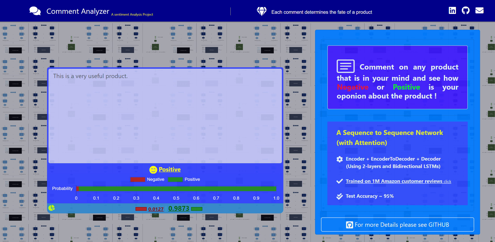
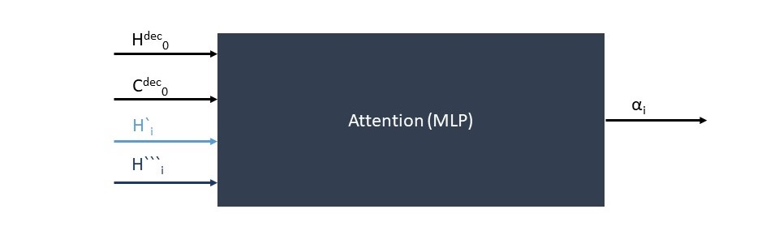
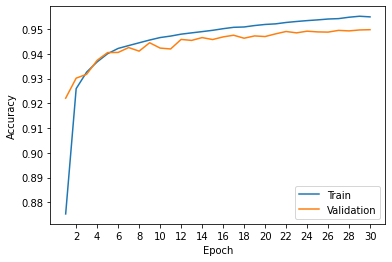

# Comment analyzer
This is a <ins>sentiment analysis</ins> project. A Web Application which determines whether a comment given for a product is **<ins>positive</ins>** or **<ins>negative</ins>** !
In fact, whether the person who bought the product is **<ins>satisfied**</ins> or **<ins>not**</ins>!




<ins>[Preview](#preview)</ins>&nbsp;&nbsp;&nbsp;
<ins>[Setup](#Setup)</ins>&nbsp;&nbsp;&nbsp;
<ins>[Details of Implementation](#Details-of-Implementation)</ins>&nbsp;&nbsp;&nbsp;
<ins>[Network](#Network)</ins>&nbsp;&nbsp;&nbsp;
<ins>[Hyperparameters and Tools](#Hyperparameters-and-Tools)</ins>&nbsp;&nbsp;&nbsp;
<ins>[Results](#Results)</ins>&nbsp;&nbsp;&nbsp;
<ins>[References](#References)</ins>&nbsp;&nbsp;&nbsp;
<ins>[Useful Resources](#Useful-Resources)</ins>&nbsp;&nbsp;&nbsp;

# Preview


### &nbsp;&nbsp;&nbsp;&nbsp;&nbsp;&nbsp;Stack:

&nbsp;&nbsp;&nbsp;&nbsp;&nbsp;&nbsp;&nbsp;&nbsp;&nbsp;&nbsp;HTML - CSS - Js - Chart.js - Underscore.js - Jquery - Bootstrap - Python - Flask 

### &nbsp;&nbsp;&nbsp;&nbsp;&nbsp;&nbsp;Icon Set:
&nbsp;&nbsp;&nbsp;&nbsp;&nbsp;&nbsp;&nbsp;&nbsp;&nbsp;&nbsp; - [Fontawesome](https://www.Fontawesome.com)

&nbsp;&nbsp;&nbsp;&nbsp;&nbsp;&nbsp;&nbsp;&nbsp;&nbsp;&nbsp; - [Bootstrap](https://icons.getbootstrap.com/)

# Setup
## Ubuntu 20 LTS
First install `python3.8` and `python3.8-venv` on the OS.

#### Check:

By typing `python3.8` and hiting Enter, python shell will appear (version 3.8).

Leave the python shell and run the commands below:

#### Commands:

```
 $ git clone https://github.com/amirdy/comment_analyzer.git
 $ cd comment_analyzer/Demo
 $ python3.8 -m venv env 
 $ source ./env/bin/activate
 (env)$ pip install -r requirements.txt
 (env)$ pip install torch==1.8.1+cpu torchvision==0.9.1+cpu  -f https://download.pytorch.org/whl/torch_stable.html
 (env)$ flask run
 ```
 It will run a <ins>Flask development server</ins>.

# Details of Implementation
## Dataset 

- [Amazon Reviews for Sentiment Analysis](https://www.kaggle.com/bittlingmayer/amazonreviews/)

This dataset consists of **~4 million** Amazon customer reviews(**~3.6million** for training and **0.4million** for testing).

It has 2 labels: 

- <b>Label 1 </b> : for comments correspond to 1 and 2-star reviews (<b>Negative</b>).

- <b>Label 2 </b> : for comments correspond to 4 and 5-star reviews (<b>Positive</b>).

## Preprocessing

I just used 1000000 samples for training(validating) and 400000 samples for testing.

- **Train set** : 780000 samples (The number of negative and positive samples is almost the same).
- **Validation set** : 220000 samples.
- **Test set** : 400000 samples.
  
- [x] Each sample  is a sequence of sentences.

- [x] First, each sample became a sequence of vocabs(tokens).

- [x] The length of each sample is equal to the size of this sequence.

- [x] The length of samples are different. For Mini Batch Gradient Descent we need to have samples with the same lenghts.

##### So what is the solution?
###### We can only consider the first N Vocabs(Tokens) for each sample.

###### Then, we can add enough \<pad\> tokens to the end of the samples with a length of less than N to reach a length of N.
 
##### But, what is the value of N?
###### Lets assume the lenght of samples in the train set is a random variable X with a Normal distribution<sup>1</sup>.
###### The average length of the samples in the training set is 92.70 and the standard deviation is 50.23.


###### We know that in the Normal distribution we have : 


###### So, here we have : 


##### Thus, considering *N = 244* can be a good choice !

#### * We can only consider the first 244 Vocabs(Tokens) for each sample.
#### * Vocabs with less than 10 repetitions will be replaced with \<UNK\>.<sup>1</sup>

# Network
#### The entire model consists of three netowrks:
###### 1. Encoder (2-layer and Bidirectional - LSTM)
###### 2. Encoder2Decoder (MLP)
###### 3. Decoder (with Attention - LSTM)

## 1. Encoder
####  Word indexes 1 to 244 were given to a 2-layer bidirectional LSTM (Encoder).

||
|:--:| 
|Left to Right Direction|

||
|:--:| 
|Right to Left Direction|

#### 2. Encoder2Decoder

The hiddens of the last time step were given to the Encoder2Decoder Network(MLP) to obtain the decoder hiddens.

This network receives hiddens of the last time step in the Encoder (every two layers for both directions) and then generates Decoder hiddens.

| |
|:--:| 
|Encoder to Decoder Network|


#### 2. Decoder
For better result, the Attention mechanism which is a simple MLP was used.
| |
|:--:| 
|Attention|

Then, a combination of Attention outputs and Encoder hiddens were given to the Decoder.
| |
|:--:| 
|Decoder Network|

# Hyperparameters and Tools
- #### Batch size: 
   - 64 
- #### Embedding Size:
  - 16
- #### Encoder:
   - Sequence lenght:
     - 244 
   - Hidden size:
     - 16
   - Number of layers:
     - 2 
   - Bidirectional:
     - True
 - #### Decoder:
   - Sequence lenght:
     - 1 
   - Hidden size:
     - 16
   - Number of Layer:
     - 1 
   - Bidirectional:
     - False

- #### Optimizer: 
   - ADAM
- #### Learning rate: 
   - 0.0005
- #### Weight Decay: 
   - 0.0001
- #### Loss: 
   - Cross entropy
- #### Train vs Validation Split: 
   - Approximately : 0.78 | 0.22  
- #### Tools: 
   - [NLTK](https://www.nltk.org/)
   - Python - Pytorch ( Using Google Colab Pro )

# Results
###### &nbsp;&nbsp; Training finished in ~ 19 Hours on Tesla V100-SXM2-16GB (using Google Colab Pro).
- ###### Best Validation Loss : 0.1355
  - ###### (In Epoch 30 | Accuracy : 94.97 %) [This model is selected]
- ###### &nbsp;&nbsp; Test Result on this model:
  - ###### &nbsp;&nbsp;&nbsp;&nbsp;<b>Loss</b> : 0.1365&nbsp;&nbsp;|   <b>Accuracy</b> : ~ 94.96 %
 


# References
[1] [Sentiment Analysis on IMDB Dataset - Seyed Naser Razavi](https://github.com/snrazavi/Deep_Learning_in_Python_2018/tree/master/Week05)

# Useful Resources
[1] [Text Classification (Sentiment Analysis) - Seyed Naser Razavi](https://youtu.be/BGI-7s3p03I)
